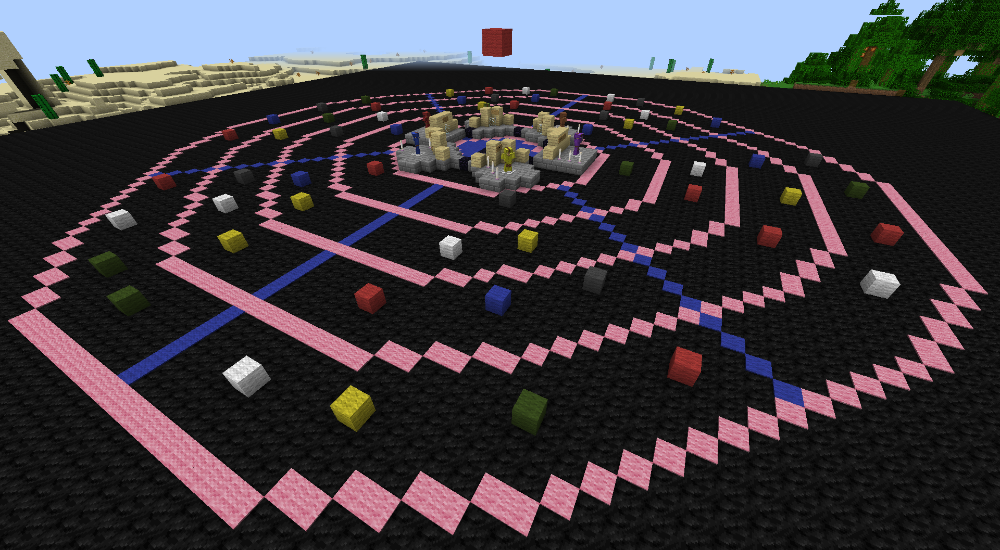

# Minecraft Panopticon
The official Alpha version of Minecraft Panopticon. Panopticon was originally developed by Maf'j Alvarez and Chris Pinchen. More information of the original board game [here](http://panopticongame.lu/about/). The original creators of the game can be found [here](http://panopticongame.lu/team/). The Alpha version made by [Nanohenry10-9](https://twitter.com/nH10_9) from [CoderDojo Luxembourg](http://coderdojo.lu/).

